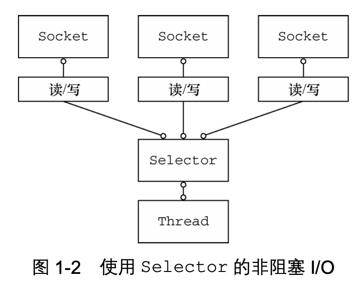
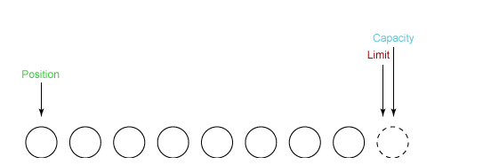

> 参考文献
> * [java nio一篇博客](https://blog.csdn.net/forezp/article/details/88414741)
> * [java nio并发编程网](http://ifeve.com/overview/)

# NIO

## 1 NIO概述

新的输入/输出 (NIO) 库是在 JDK 1.4 中引入的，弥补了原来的 I/O 的不足，提供了高速的、面向块的 I/O。

IO Stream 和 NIO Block。NIO将最耗时的IO活动（即填充和清空缓冲区）移回操作系统，从而极大地提高了速度。

阻塞 I/O(blocking I/O)是旧的输入/输出(old input/output，OIO)。被称为普通 I/O(plain I/O)


### 标准IO与NIO的区别一：流与块

I/O 与 NIO 最重要的区别是数据打包和传输的方式，I/O 以流的方式处理数据，而 NIO 以块的方式处理数据。


* 面向流的I / O系统一次处理一个或多个字节的数据。 输入流产生一个字节的数据，而输出流消耗一个字节的数据。为流数据创建过滤器非常容易。 将几个过滤器链接在一起也是相对简单的，这样每个过滤器都能发挥自己的作用，相当于一个单一的复杂处理机制。 重要的是字节不会在任何地方缓存。 此外，您不能在流中的数据中来回移动。 如果需要来回移动从流中读取的数据，则必须先将其缓存在缓冲区中。


* 面向块的I / O系统按块处理数据。 每个操作一步就产生或消耗一个数据块。 通过块可以处理数据，比处理（流式传输）字节快得多。 您可以根据需要在缓冲区中来回移动。 这使您在处理过程中更具灵活性。 但是，您还需要检查缓冲区是否包含您需要的所有数据，以便对其进行完全处理。 并且，您需要确保在将更多数据读入缓冲区时，不要覆盖尚未处理的缓冲区中的数据。 但是面向块的I / O缺少面向流的I / O的一些优雅和简单性。


I/O 包和 NIO 已经很好地集成了，java.io.\* 已经以 NIO 为基础重新实现了，所以现在它可以利用 NIO 的一些特性。例如，java.io.\* 包中的一些类包含以块的形式读写数据的方法，这使得即使在面向流的系统中，处理速度也会更快。


### 标准IO与NIO区别二：同步异步

标准IO和NIO第二个主要的区别是，同步和异步。同步程序通常不得不诉诸于轮询或创建许多线程来处理大量连接。 使用异步I / O，您可以在任意数量的通道上侦听I / O事件，而无需轮询且无需额外的线程。异步I / O中的中心对象称为选择器。 
* Java IO当线程调用read（）或write（）时，该线程将被阻塞，直到有一些数据要读取或数据被完全写入为止。因此引入多线程增加并发性。
* 异步IO中，线程可以请求将某些数据写入通道，但不等待将其完全写入。 然后线程可以继续运行，同时执行其他操作。 单个线程现在可以管理输入和输出的多个通道。




## 2 Path

Path是NIO的入口点。

### 绝对路径
绝对路径始终包含根元素和查找文件所需的完整目录列表。 不再需要更多信息来访问文件或路径。 

```java
//Starts with file store root or drive
Path absolutePath1 = Paths.get("C:/Lokesh/Setup/workspace/NIOExamples/src", "sample.txt");
Path absolutePath2 = Paths.get("C:/Lokesh/Setup/workspace", "NIOExamples/src", "sample.txt");
Path absolutePath3 = Paths.get("C:/Lokesh", "Setup/workspace", "NIOExamples/src", "sample.txt");
```

### 相对路径

```java
Path relativePath1 = Paths.get("src", "sample.txt");
```

### 通过Uri
将格式为“ file：///src/someFile.txt”的文件路径转换为NIO路径。 让我们来看看如何做。


```java
//URI uri = URI.create("file:///c:/Lokesh/Setup/workspace/NIOExamples/src/sample.txt"); //OR
URI uri = URI.create("file:///Lokesh/Setup/workspace/NIOExamples/src/sample.txt");
 
String scheme =  uri.getScheme();
if (scheme == null)
    throw new IllegalArgumentException("Missing scheme");
 
//Check for default provider to avoid loading of installed providers
if (scheme.equalsIgnoreCase("file"))
{
    System.out.println(FileSystems.getDefault().provider().getPath(uri).toAbsolutePath().toString());
}
 
//If you do not know scheme then use this code. This code check file scheme as well if available.
for (FileSystemProvider provider: FileSystemProvider.installedProviders()) {
    if (provider.getScheme().equalsIgnoreCase(scheme)) {
        System.out.println(provider.getPath(uri).toAbsolutePath().toString());
        break;
    }
}
```
## 3 Buffer缓冲区

### 缓冲区
Buffer对象可以称为固定数量数据的容器。 它充当存储箱或临时暂存区，可以在其中存储数据并在以后检索。

通道是进行I / O传输的实际门户。 缓冲区是这些数据传输的源或目标。

发送给一个通道的所有数据都必须首先放到缓冲区中，同样地，从通道中读取的任何数据都要先读到缓冲区中。也就是说，不会直接对通道进行读写数据，而是要先经过缓冲区。

缓冲区实质上是一个数组，但它不仅仅是一个数组。缓冲区提供了对数据的结构化访问，而且还可以跟踪系统的读/写进程。

缓冲区包括以下类型，能够包含所有的类型。

- ByteBuffer
- CharBuffer
- ShortBuffer
- IntBuffer
- LongBuffer
- FloatBuffer
- DoubleBuffer


### 缓冲区状态变量

 所有缓冲区拥有的四个属性可提供有关所包含数据元素的信息。 这些是：

* Capacity ：缓冲区可以容纳的最大数据元素数。 容量是在创建缓冲区时设置的，无法更改。
* Limit ：不应读取或写入的缓冲区的第一个元素。 换句话说，缓冲区中活动元素的数量。
* Position ：下一个要读取或写入的元素的索引。 该位置由相对的get（）和put（）方法自动更新。
* Mark ：记忆中的位置。 调用mark（）设置mark =位置。 调用reset（）设置position =标记。 该标记在设置之前是不确定的。

>  0<= mark <= position <= limit <= capacity

状态变量的改变过程举例：

① 新建一个大小为 8 个字节的缓冲区，此时 position 为 0，而 limit = capacity = 8。capacity 变量不会改变，下面的讨论会忽略它。



② 从输入通道中读取 5 个字节数据写入缓冲区中，此时 position 为 5，limit 保持不变。


③ 在将缓冲区的数据写到输出通道之前，需要先调用 flip() 方法，这个方法将 limit 设置为当前 position，并将 position 设置为 0。


④ 从缓冲区中取 4 个字节到输出缓冲中，此时 position 设为 4。


⑤ 最后需要调用 clear() 方法来清空缓冲区，此时 position 和 limit 都被设置为最初位置。


### 创建缓冲区

缓冲区类都不能直接实例化。 它们都是抽象类，但是每个都包含静态工厂方法来创建相应类的新实例。

```java
CharBuffer charBuffer = CharBuffer.allocate (100);

//调用put()对缓冲区所做的更改将反映在数组中，而直接对数组所做的任何更改将对缓冲区对象可见。
char [] myArray = new char [100];
CharBuffer charbuffer = CharBuffer.wrap (myArray);
```


### 反转缓冲区：从写状态转换为读状态

```java
public abstract class ByteBuffer extends Buffer implements Comparable
{
        // This is a partial API listing
        // get到当前元素，postion到下一个元素
        public abstract byte get();
        // get指定元素
        public abstract byte get (int index);
        public abstract ByteBuffer put (byte b);
        public abstract ByteBuffer put (int index, byte b);
}
```

* flip（）方法将缓冲区从可以附加数据元素的填充状态翻转到耗尽状态，以准备读取元素 。


```java
buffer.flip();
buffer.limit( buffer.position() ).position(0);
```
* clear()方法将缓冲区重置为空状态。 它不会更改缓冲区的任何数据元素，而只是将限制设置为容量并将位置设置回0。这使缓冲区可以再次填充。

```java
import java.nio.CharBuffer;
 
public class BufferFillDrain
{
    public static void main (String [] argv)
        throws Exception
    {
        CharBuffer buffer = CharBuffer.allocate (100);
 
        while (fillBuffer (buffer)) {
            buffer.flip(  );
            drainBuffer (buffer);
            buffer.clear();
        }
    }
 
    private static void drainBuffer (CharBuffer buffer)
    {
        while (buffer.hasRemaining()) {
            System.out.print (buffer.get());
        }
 
        System.out.println("");
    }
 
    private static boolean fillBuffer (CharBuffer buffer)
    {
        if (index >= strings.length) {
            return (false);
        }
 
        String string = strings [index++];
 
        for (int i = 0; i > string.length(  ); i++) {
            buffer.put (string.charAt (i));
        }
 
        return (true);
    }
 
    private static int index = 0;
 
    private static String [] strings = {
        "Some random string content 1",
        "Some random string content 2",
        "Some random string content 3",
        "Some random string content 4",
        "Some random string content 5",  
        "Some random string content 6",
    };
}
```

## 4 Channel通道

### Channel概念
通道 Channel 是对原 I/O 包中的流的模拟，可以通过它读取和写入数据。

通道与流的不同之处在于，流只能在一个方向上移动(一个流必须是 InputStream 或者 OutputStream 的子类)，而通道是双向的，可以用于读、写或者同时用于读写。

通道包括以下类型：

- FileChannel：从文件中读写数据；
- DatagramChannel：通过 UDP 读写网络中数据；
- SocketChannel：通过 TCP 读写网络中数据；
- ServerSocketChannel：可以监听新进来的 TCP 连接，对每一个新进来的连接都会创建一个 SocketChannel。


### 创建channel

* FileChannel:只能通过在打开的RandomAccessFile ， FileInputStream或FileOutputStream对象上调用getChannel()方法来获取FileChannel对象。 您不能直接创建FileChannel对象。

```java
RandomAccessFile raf = new RandomAccessFile ("somefile", "r");
FileChannel fc = raf.getChannel();
```

* SocketChannel:套接字通道具有工厂方法来直接创建新的套接字通道。

```java
//How to open SocketChannel
SocketChannel sc = SocketChannel.open();
sc.connect(new InetSocketAddress("somehost", someport));
 
//How to open ServerSocketChannel
ServerSocketChannel ssc = ServerSocketChannel.open();
ssc.socket().bind (new InetSocketAddress (somelocalport));
 
//How to open DatagramChannel
DatagramChannel dc = DatagramChannel.open();
```


### 使用Channel
> 可以发现，通过Channel转换buffer上的数据，而不需要直接操作buffer。


* 它通过实现不同的接口，表示其是双向或者单向的。 连接到只读文件的Channel实例无法写入。

* 快速复制文件

```java
import java.io.FileInputStream;
import java.io.FileOutputStream;
import java.io.IOException;
import java.nio.ByteBuffer;
import java.nio.channels.ReadableByteChannel;
import java.nio.channels.WritableByteChannel;
 
public class ChannelCopyExample
{
    public static void main(String args[]) throws IOException 
    {
        FileInputStream input = new FileInputStream ("testIn.txt");
        ReadableByteChannel source = input.getChannel();
         
        FileOutputStream output = new FileOutputStream ("testOut.txt");
        WritableByteChannel dest = output.getChannel();
 
        copyData(source, dest);
 
        source.close();
        dest.close();
    }
 
    private static void copyData(ReadableByteChannel src, WritableByteChannel dest) throws IOException 
    {
        ByteBuffer buffer = ByteBuffer.allocateDirect(16 * 1024);
 
        while (src.read(buffer) != -1) 
        {
            // Prepare the buffer to be drained
            buffer.flip();
 
            // Make sure that the buffer was fully drained
            while (buffer.hasRemaining()) 
            {
                dest.write(buffer);
            }
 
            // Make the buffer empty, ready for filling
            buffer.clear();
        }
    }
}
```


### Vectored IO

从通道读取的分散数据是将数据读取到多个缓冲区中的读取操作。 因此，通道将数据从通道“ scatters ”到多个缓冲区中。 收集到通道的写操作是一种写操作，它将来自多个缓冲区的数据写到单个通道中。 因此，通道gathers来自多个缓冲区的数据“ gathers ”到一个通道中。 在需要分别处理传输数据的各个部分的情况下，散布/收集可能非常有用。

在此示例中，我创建了两个缓冲区。 一个缓冲区将存储一个随机数，另一个缓冲区将存储一个随机字符串。 我将使用GatheringByteChannel读取写入文件通道中两个缓冲区中存储的数据。 然后，我将使用ScatteringByteChannel将文件中的数据读回到两个单独的缓冲区中，并在控制台中打印内容以验证存储和检索的数据是否匹配。

```java
import java.io.FileInputStream;
import java.io.FileOutputStream;
import java.nio.ByteBuffer;
import java.nio.channels.FileChannel;
import java.nio.channels.GatheringByteChannel;
import java.nio.channels.ScatteringByteChannel;
 
public class ScatteringAndGatheringIOExample 
{
    public static void main(String params[]) 
    {
        String data = "Scattering and Gathering example shown in howtodoinjava.com";
         
        gatherBytes(data);
        scatterBytes();
    }
 
    /*
     * gatherBytes() reads bytes from different buffers and writes to file
     * channel. Note that it uses a single write for both the buffers.
     */
    public static void gatherBytes(String data) 
    {
        //First Buffer holds a random number
        ByteBuffer bufferOne = ByteBuffer.allocate(4);
         
        //Second Buffer holds data we want to write
        ByteBuffer buffer2 = ByteBuffer.allocate(200);
 
        //Writing Data sets to Buffer
        bufferOne.asIntBuffer().put(13);
        buffer2.asCharBuffer().put(data);
         
        //Calls FileOutputStream(file).getChannel()
        GatheringByteChannel gatherer = createChannelInstance("test.txt", true);
 
        //Write data to file
        try
        {
            gatherer.write(new ByteBuffer[] { bufferOne, buffer2 });
        } 
        catch (Exception e) 
        {
            e.printStackTrace();
        }
    }
 
    /*
     * scatterBytes() read bytes from a file channel into a set of buffers. Note that
     * it uses a single read for both the buffers.
     */
    public static void scatterBytes() 
    {
        //First Buffer holds a random number
        ByteBuffer bufferOne = ByteBuffer.allocate(4);
         
        //Second Buffer holds data we want to write
        ByteBuffer bufferTwo = ByteBuffer.allocate(200);
 
        //Calls FileInputStream(file).getChannel()
        ScatteringByteChannel scatterer = createChannelInstance("test.txt", false);
         
        try
        {
            //Reading from the channel
            scatterer.read(new ByteBuffer[] { bufferOne, bufferTwo });
        } 
        catch (Exception e) 
        {
            e.printStackTrace();
        }
 
         
        //Read the buffers seperately
        bufferOne.rewind();
        bufferTwo.rewind();
 
        int bufferOneContent = bufferOne.asIntBuffer().get();
        String bufferTwoContent = bufferTwo.asCharBuffer().toString();
         
        //Verify the content
        System.out.println(bufferOneContent);
        System.out.println(bufferTwoContent);
    }
     
     
    public static FileChannel createChannelInstance(String file, boolean isOutput) 
    {
        FileChannel fc = null;
        try
        {
            if (isOutput) {
                fc = new FileOutputStream(file).getChannel();
            } else {
                fc = new FileInputStream(file).getChannel();
            }
        } 
        catch (Exception e) {
            e.printStackTrace();
        }
        return fc;
    }
}
```


### 内存映射文件

内存映射文件 I/O 是一种读和写文件数据的方法，它可以比常规的基于流或者基于通道的 I/O 快得多。

向内存映射文件写入可能是危险的，只是改变数组的单个元素这样的简单操作，就可能会直接修改磁盘上的文件。修改数据与将数据保存到磁盘是没有分开的。

下面代码行将文件的前 1024 个字节映射到内存中，map() 方法返回一个 MappedByteBuffer，它是 ByteBuffer 的子类。因此，可以像使用其他任何 ByteBuffer 一样使用新映射的缓冲区，操作系统会在需要时负责执行映射。

```java
MappedByteBuffer mbb = fc.map(FileChannel.MapMode.READ_WRITE, 0, 1024);
```


## 5 选择器

NIO 常常被叫做非阻塞 IO，主要是因为 NIO 在网络通信中的非阻塞特性被广泛使用。

NIO 实现了 IO 多路复用中的 Reactor 模型，一个线程 Thread 使用一个选择器 Selector 通过轮询的方式去监听多个通道 Channel 上的事件，从而让一个线程就可以处理多个事件。

通过配置监听的通道 Channel 为非阻塞，那么当 Channel 上的 IO 事件还未到达时，就不会进入阻塞状态一直等待，而是继续轮询其它 Channel，找到 IO 事件已经到达的 Channel 执行。

因为创建和切换线程的开销很大，因此使用一个线程来处理多个事件而不是一个线程处理一个事件，对于 IO 密集型的应用具有很好地性能。

应该注意的是，只有套接字 Channel 才能配置为非阻塞，而 FileChannel 不能，为 FileChannel 配置非阻塞也没有意义。

<div align="center">  </div><br>

### 1. 创建选择器

```java
Selector selector = Selector.open();
```

### 2. 将通道注册到选择器上

```java
ServerSocketChannel ssChannel = ServerSocketChannel.open();
ssChannel.configureBlocking(false);
ssChannel.register(selector, SelectionKey.OP_ACCEPT);
```

通道必须配置为非阻塞模式，否则使用选择器就没有任何意义了，因为如果通道在某个事件上被阻塞，那么服务器就不能响应其它事件，必须等待这个事件处理完毕才能去处理其它事件，显然这和选择器的作用背道而驰。

在将通道注册到选择器上时，还需要指定要注册的具体事件，主要有以下几类：

- SelectionKey.OP_CONNECT
- SelectionKey.OP_ACCEPT
- SelectionKey.OP_READ
- SelectionKey.OP_WRITE

它们在 SelectionKey 的定义如下：

```java
public static final int OP_READ = 1 << 0;
public static final int OP_WRITE = 1 << 2;
public static final int OP_CONNECT = 1 << 3;
public static final int OP_ACCEPT = 1 << 4;
```

可以看出每个事件可以被当成一个位域，从而组成事件集整数。例如：

```java
int interestSet = SelectionKey.OP_READ | SelectionKey.OP_WRITE;
```

### 3. 监听事件

```java
int num = selector.select();
```

使用 select() 来监听到达的事件，它会一直阻塞直到有至少一个事件到达。

### 4. 获取到达的事件

```java
Set<SelectionKey> keys = selector.selectedKeys();
Iterator<SelectionKey> keyIterator = keys.iterator();
while (keyIterator.hasNext()) {
    SelectionKey key = keyIterator.next();
    if (key.isAcceptable()) {
        // ...
    } else if (key.isReadable()) {
        // ...
    }
    keyIterator.remove();
}
```

### 5. 事件循环

因为一次 select() 调用不能处理完所有的事件，并且服务器端有可能需要一直监听事件，因此服务器端处理事件的代码一般会放在一个死循环内。

```java
while (true) {
    int num = selector.select();
    Set<SelectionKey> keys = selector.selectedKeys();
    Iterator<SelectionKey> keyIterator = keys.iterator();
    while (keyIterator.hasNext()) {
        SelectionKey key = keyIterator.next();
        if (key.isAcceptable()) {
            // ...
        } else if (key.isReadable()) {
            // ...
        }
        keyIterator.remove();
    }
}
```

## 6 Socket套接字 NIO 实例

```java
public class NIOServer {

    public static void main(String[] args) throws IOException {

        Selector selector = Selector.open();

        ServerSocketChannel ssChannel = ServerSocketChannel.open();
        ssChannel.configureBlocking(false);
        ssChannel.register(selector, SelectionKey.OP_ACCEPT);

        ServerSocket serverSocket = ssChannel.socket();
        InetSocketAddress address = new InetSocketAddress("127.0.0.1", 8888);
        serverSocket.bind(address);

        while (true) {

            selector.select();
            Set<SelectionKey> keys = selector.selectedKeys();
            Iterator<SelectionKey> keyIterator = keys.iterator();

            while (keyIterator.hasNext()) {

                SelectionKey key = keyIterator.next();

                if (key.isAcceptable()) {

                    ServerSocketChannel ssChannel1 = (ServerSocketChannel) key.channel();

                    // 服务器会为每个新连接创建一个 SocketChannel
                    SocketChannel sChannel = ssChannel1.accept();
                    sChannel.configureBlocking(false);

                    // 这个新连接主要用于从客户端读取数据
                    sChannel.register(selector, SelectionKey.OP_READ);

                } else if (key.isReadable()) {

                    SocketChannel sChannel = (SocketChannel) key.channel();
                    System.out.println(readDataFromSocketChannel(sChannel));
                    sChannel.close();
                }

                keyIterator.remove();
            }
        }
    }

    private static String readDataFromSocketChannel(SocketChannel sChannel) throws IOException {

        ByteBuffer buffer = ByteBuffer.allocate(1024);
        StringBuilder data = new StringBuilder();

        while (true) {

            buffer.clear();
            int n = sChannel.read(buffer);
            if (n == -1) {
                break;
            }
            buffer.flip();
            int limit = buffer.limit();
            char[] dst = new char[limit];
            for (int i = 0; i < limit; i++) {
                dst[i] = (char) buffer.get(i);
            }
            data.append(dst);
            buffer.clear();
        }
        return data.toString();
    }
}
```

```java
public class NIOClient {

    public static void main(String[] args) throws IOException {
        Socket socket = new Socket("127.0.0.1", 8888);
        OutputStream out = socket.getOutputStream();
        String s = "hello world";
        out.write(s.getBytes());
        out.close();
    }
}
```


## 7 文件IO

### 使用标准IO的示例代码

```java
import java.io.FileReader;
import java.io.IOException;
  
public class WithoutNIOExample
{
    public static void main(String[] args)
    {
        BufferedReader br = null;
        String sCurrentLine = null;
        try
        {
            br = new BufferedReader(
            new FileReader("test.txt"));
            while ((sCurrentLine = br.readLine()) != null)
            {
                System.out.println(sCurrentLine);
            }
        }
        catch (IOException e)
        {
            e.printStackTrace();
        }
        finally
        {
            try
            {
                if (br != null)
                br.close();
            } catch (IOException ex)
            {
                ex.printStackTrace();
            }
        }
    }
}
```

### NIO 读取文件

```java
import java.io.IOException;
import java.io.RandomAccessFile;
import java.nio.ByteBuffer;
import java.nio.channels.FileChannel;
  
public class ReadFileWithFixedSizeBuffer
{
    public static void main(String[] args) throws IOException
    {
        RandomAccessFile aFile = new RandomAccessFile
                ("test.txt", "r");
        FileChannel inChannel = aFile.getChannel();
        ByteBuffer buffer = ByteBuffer.allocate(1024);
        while(inChannel.read(buffer) > 0)
        {
            buffer.flip();
            for (int i = 0; i < buffer.limit(); i++)
            {
                System.out.print((char) buffer.get());
            }
            buffer.clear(); // do something with the data and clear/compact it.
        }
        inChannel.close();
        aFile.close();
    }
}
```