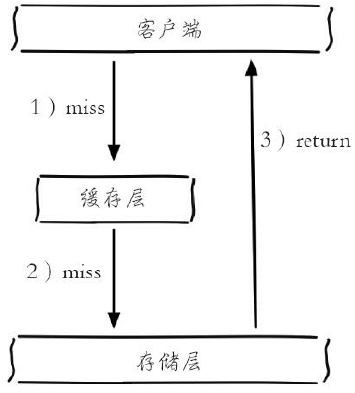
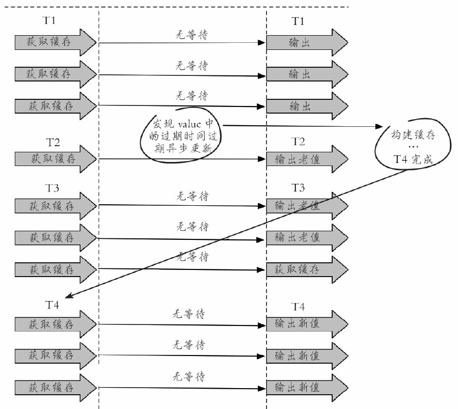

在生产环境中，会因为很多的原因造成访问请求绕过了缓存，都需要访问数据库持久层，虽然对Redsi缓存服务器不会造成影响，但是数据库的负载就会增大，使缓存的作用降低

## 1 缓存穿透

### 1、缓存穿透理解
   
缓存穿透是指查询一个根本不存在的数据，缓存层和持久层都不会命中。在日常工作中出于容错的考虑，如果从持久层查不到数据则不写入缓存层，缓存穿透将导致不存在的数据每次请求都要到持久层去查询，失去了缓存保护后端持久的意义。

缓存穿透示意图：

缓存穿透问题可能会使后端存储负载加大，由于很多后端持久层不具备高并发性，甚至可能造成后端存储宕机。通常可以在程序中统计总调用数、缓存层命中数、如果同一个Key的缓存命中率很低，可能就是出现了缓存穿透问题。

造成缓存穿透的基本原因有两个。第一，自身业务代码或者数据出现问题（例如：set 和 get 的key不一致），第二，一些恶意攻击、爬虫等造成大量空命中（爬取线上商城商品数据，超大循环递增商品的ID）

### 2、解决方案

**2.1 缓存空对象**
缓存空对象：是指在持久层没有命中的情况下，对key进行set （key,null）

缓存空对象会有两个问题：
* 第一，value为null 不代表不占用内存空间，空值做了缓存，意味着缓存层中存了更多的键，需要更多的内存空间，比较有效的方法是针对这类数据设置一个较短的过期时间，让其自动剔除。

* 第二，缓存层和存储层的数据会有一段时间窗口的不一致，可能会对业务有一定影响。例如过期时间设置为5分钟，如果此时存储层添加了这个数据，那此段时间就会出现缓存层和存储层数据的不一致，此时可以利用消息系统或者其他方式清除掉缓存层中的空对象。

**2.2 布隆过滤器拦截**

在访问缓存层和存储层之前，将存在的key用布隆过滤器提前保存起来，做第一层拦截，当收到一个对key请求时先用布隆过滤器验证是key否存在，如果存在在进入缓存层、存储层。可以使用bitmap做布隆过滤器。这种方法适用于数据命中不高、数据相对固定、实时性低的应用场景，代码维护较为复杂，但是缓存空间占用少。

布隆过滤器实际上是一个很长的二进制向量和一系列随机映射函数。布隆过滤器可以用于检索一个元素是否在一个集合中。

它的优点是空间效率和查询时间都远远超过一般的算法，缺点是有一定的误识别率和删除困难。

布隆过滤器拦截的算法描述：

* 初始状态时，BloomFilter是一个长度为m的位数组，每一位都置为0。

* 添加元素x时，x使用k个hash函数得到k个hash值，对m取余，对应的bit位设置为1。

* 判断y是否属于这个集合，对y使用k个哈希函数得到k个哈希值，对m取余，所有对应的位置都是1，则认为y属于该集合（哈希冲突，可能存在误判），否则就认为y不属于该集合。可以通过增加哈希函数和增加二进制位数组的长度来降低错报率。
 

**2.3、两种方案的对比**

 

## 2 缓存击穿

### 1、缓存击穿的理解

系统中存在以下两个问题时需要引起注意：

* 当前key是一个热点key（例如一个秒杀活动），并发量非常大。
* 重建缓存不能在短时间完成，可能是一个复杂计算，例如复杂的SQL、多次IO、多个依赖等。

在缓存失效的瞬间，有大量线程来重建缓存，造成后端负载加大，甚至可能会让应用崩溃。

 

### 2、解决方案

**2.1 分布式互斥锁**
只允许一个线程重建缓存，其他线程等待重建缓存的线程执行完，重新从缓存获取数据即可。set(key,value,timeout)

**2.2、永不过期**
从缓存层面来看，确实没有设置过期时间，所以不会出现热点key过期后产生的问题，也就是“物理”不过期。
从功能层面来看，为每个value设置一个逻辑过期时间，当发现超过逻辑过期时间后，会使用单独的线程去更新缓

### 3、两种方案对比：

* 分布式互斥锁：这种方案思路比较简单，但是存在一定的隐患，如果在查询数据库 + 和 重建缓存（key失效后进行了大量的计算）时间过长，也可能会存在死锁和线程池阻塞的风险，高并发情景下吞吐量会大大降低！但是这种方法能够较好地降低后端存储负载，并在一致性上做得比较好。

* 永远不过期：这种方案由于没有设置真正的过期时间，实际上已经不存在热点key产生的一系列危害，但是会存在数据不一致的情况，同时代码复杂度会增大。

## 3 缓存雪崩
### 1、概念理解

如果缓存集中在一段时间内失效，发生大量的缓存穿透，所有的查询都落在数据库上，造成了缓存雪崩。

这个没有完美解决办法，但可以分析用户行为，尽量让失效时间点均匀分布。大多数系统设计者考虑用加锁或者队列的方式保证缓存的单线程（进程）写，从而避免失效时大量的并发请求落到底层存储系统上。

### 2、解决方案

**2.1  缓存层高可用：**
       可以把缓存层设计成高可用的，即使个别节点、个别机器、甚至是机房宕掉，依然可以提供服务。利用sentinel或cluster实现。
**2.2  做二级缓存，或者双缓存策略：**
      采用多级缓存，本地进程作为一级缓存，redis作为二级缓存，不同级别的缓存设置的超时时间不同，即使某级缓存过期了，也有其他级别缓存兜底
**2.3 数据预热：**
     可以通过缓存reload机制，预先去更新缓存，再即将发生大并发访问前手动触发加载缓存不同的key，设置不同的过期时间，让缓存失效的时间点尽量均匀
**2.4 加锁排队**
* 限流-- 限流算法. 1.计数 2.滑动窗口 3.  令牌桶Token Bucket 4.漏桶 leaky bucket [1]
* 在缓存失效后，通过加锁或者队列来控制读数据库写缓存的线程数量。比如对某个key只允许一个线程查询数据和写缓存，其他线程等待。
* 业界比较常用的做法，是使用mutex。简单地来说，就是在缓存失效的时候（判断拿出来的值为空），不是立即去load db，而是先使用缓存工具的某些带成功操作返回值的操作（比如Redis的SETNX或者Memcache的ADD）去set一个mutex key，当操作返回成功时，再进行load db的操作并回设缓存；否则，就重试整个get缓存的方法。
* SETNX，是「SET if Not eXists」的缩写，也就是只有不存在的时候才设置，可以利用它来实现锁的效果。

## 总结
* 不存在的key——缓存穿透——缓存空对象
* 同一个Key失效大量访问——缓存击穿——加锁互斥
* 大量key同时失效——缓存雪崩——双缓存、队列

GuavaCache本身实现了加锁互斥，有效防止缓存击穿。

* 更新锁定：类似于分布式锁，作用体现于对同一个key，只让一个请求去读源并回填缓存，其他请求阻塞等待。