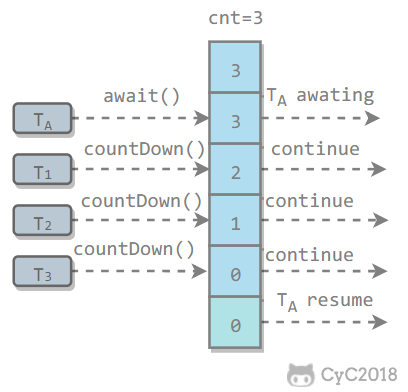
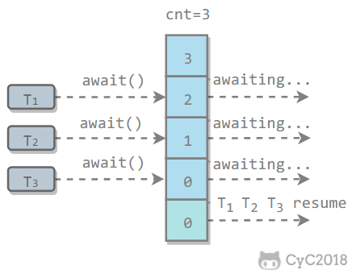

## 1 J.U.C - AQS

java.util.concurrent（J.U.C）大大提高了并发性能，AQS 被认为是 J.U.C 的核心。

### CountDownLatch

用来控制一个或者多个线程等待多个线程。

维护了一个计数器 cnt，每次调用 countDown() 方法会让计数器的值减 1，减到 0 的时候，那些因为调用 await() 方法而在等待的线程就会被唤醒。



```java
public class CountdownLatchExample {

    public static void main(String[] args) throws InterruptedException {
        final int totalThread = 10;
        CountDownLatch countDownLatch = new CountDownLatch(totalThread);
        ExecutorService executorService = Executors.newCachedThreadPool();
        for (int i = 0; i < totalThread; i++) {
            executorService.execute(() -> {
                System.out.print("run..");
                countDownLatch.countDown();
            });
        }
        countDownLatch.await();
        System.out.println("end");
        executorService.shutdown();
    }
}
```

```html
run..run..run..run..run..run..run..run..run..run..end
```

### CyclicBarrier

用来控制多个线程互相等待，只有当多个线程都到达时，这些线程才会继续执行。

和 CountdownLatch 相似，都是通过维护计数器来实现的。线程执行 await() 方法之后计数器会减 1，并进行等待，直到计数器为 0，所有调用 await() 方法而在等待的线程才能继续执行。

CyclicBarrier 和 CountdownLatch 的一个区别是，CyclicBarrier 的计数器通过调用 reset() 方法可以循环使用，所以它才叫做循环屏障。

CyclicBarrier 有两个构造函数，其中 parties 指示计数器的初始值，barrierAction 在所有线程都到达屏障的时候会执行一次。

```java
public CyclicBarrier(int parties, Runnable barrierAction) {
    if (parties <= 0) throw new IllegalArgumentException();
    this.parties = parties;
    this.count = parties;
    this.barrierCommand = barrierAction;
}

public CyclicBarrier(int parties) {
    this(parties, null);
}
```



```java
public class CyclicBarrierExample {

    public static void main(String[] args) {
        final int totalThread = 10;
        CyclicBarrier cyclicBarrier = new CyclicBarrier(totalThread);
        ExecutorService executorService = Executors.newCachedThreadPool();
        for (int i = 0; i < totalThread; i++) {
            executorService.execute(() -> {
                System.out.print("before..");
                try {
                    cyclicBarrier.await();
                } catch (InterruptedException | BrokenBarrierException e) {
                    e.printStackTrace();
                }
                System.out.print("after..");
            });
        }
        executorService.shutdown();
    }
}
```

```html
before..before..before..before..before..before..before..before..before..before..after..after..after..after..after..after..after..after..after..after..
```

### Semaphore

Semaphore 类似于操作系统中的信号量，可以控制对互斥资源的访问线程数。

以下代码模拟了对某个服务的并发请求，每次只能有 3 个客户端同时访问，请求总数为 10。

```java
public class SemaphoreExample {

    public static void main(String[] args) {
        final int clientCount = 3;
        final int totalRequestCount = 10;
        Semaphore semaphore = new Semaphore(clientCount);
        ExecutorService executorService = Executors.newCachedThreadPool();
        for (int i = 0; i < totalRequestCount; i++) {
            executorService.execute(()->{
                try {
                    semaphore.acquire();
                    System.out.print(semaphore.availablePermits() + " ");
                } catch (InterruptedException e) {
                    e.printStackTrace();
                } finally {
                    semaphore.release();
                }
            });
        }
        executorService.shutdown();
    }
}
```

```html
2 1 2 2 2 2 2 1 2 2
```


### FutureTask

在介绍 Callable 时我们知道它可以有返回值，返回值通过 Future\<V\> 进行封装。FutureTask 实现了 RunnableFuture 接口，该接口继承自 Runnable 和 Future\<V\> 接口，这使得 FutureTask 既可以当做一个任务执行，也可以有返回值。

```java
public class FutureTask<V> implements RunnableFuture<V>
```

```java
public interface RunnableFuture<V> extends Runnable, Future<V>
```

FutureTask 可用于异步获取执行结果或取消执行任务的场景。当一个计算任务需要执行很长时间，那么就可以用 FutureTask 来封装这个任务，主线程在完成自己的任务之后再去获取结果。

```java
public class FutureTaskExample {

    public static void main(String[] args) throws ExecutionException, InterruptedException {
        FutureTask<Integer> futureTask = new FutureTask<Integer>(new Callable<Integer>() {
            @Override
            public Integer call() throws Exception {
                int result = 0;
                for (int i = 0; i < 100; i++) {
                    Thread.sleep(10);
                    result += i;
                }
                return result;
            }
        });

        Thread computeThread = new Thread(futureTask);
        computeThread.start();

        Thread otherThread = new Thread(() -> {
            System.out.println("other task is running...");
            try {
                Thread.sleep(1000);
            } catch (InterruptedException e) {
                e.printStackTrace();
            }
        });
        otherThread.start();
        System.out.println(futureTask.get());
    }
}
```

```html
other task is running...
4950
```


## 2 J.U.C -并发容器

并发集合是指使用了最新并发能力的集合，在JUC包下。而同步集合指之前用同步锁实现的集合

### CopyOnWrite

CopyOnWriteArrayList在写的时候会复制一个副本，对副本写，写完用副本替换原值，读的时候不需要同步，适用于写少读多的场合。


CopyOnWriteArraySet基于CopyOnWriteArrayList来实现的，只是在不允许存在重复的对象这个特性上遍历处理了一下。


### BlockingQueue

在并发队列上JDK提供了两套实现，
* 一个是以ConcurrentLinkedQueue为代表的高性能队列
* 一个是以BlockingQueue接口为代表的阻塞队列。

ConcurrentLinkedQueue适用于高并发场景下的队列，通过无锁的方式实现，通常ConcurrentLinkedQueue的性能要优于BlockingQueue。BlockingQueue的典型应用场景是生产者-消费者模式中，如果生产快于消费，生产队列装满时会阻塞，等待消费。


java.util.concurrent.BlockingQueue 接口有以下阻塞队列的实现：

-   **FIFO 队列**  ：LinkedBlockingQueue、ArrayBlockingQueue（固定长度）
-   **优先级队列**  ：PriorityBlockingQueue

提供了阻塞的 take() 和 put() 方法：如果队列为空 take() 将阻塞，直到队列中有内容；如果队列为满 put() 将阻塞，直到队列有空闲位置。

**使用 BlockingQueue 实现生产者消费者问题**  

```java
public class ProducerConsumer {

    private static BlockingQueue<String> queue = new ArrayBlockingQueue<>(5);

    private static class Producer extends Thread {
        @Override
        public void run() {
            try {
                queue.put("product");
            } catch (InterruptedException e) {
                e.printStackTrace();
            }
            System.out.print("produce..");
        }
    }

    private static class Consumer extends Thread {

        @Override
        public void run() {
            try {
                String product = queue.take();
            } catch (InterruptedException e) {
                e.printStackTrace();
            }
            System.out.print("consume..");
        }
    }
}
```

```java
public static void main(String[] args) {
    for (int i = 0; i < 2; i++) {
        Producer producer = new Producer();
        producer.start();
    }
    for (int i = 0; i < 5; i++) {
        Consumer consumer = new Consumer();
        consumer.start();
    }
    for (int i = 0; i < 3; i++) {
        Producer producer = new Producer();
        producer.start();
    }
}
```

```html
produce..produce..consume..consume..produce..consume..produce..consume..produce..consume..
```


### Concurrent
* ConcurrentLinkedQueue
* ConcurrentLinkedDeque

* ConcurrentHashMap
* ConcurrentHashSet


* ConcurrentSkipListMap
* ConcurrentSkipListSet

ConcurrentHashMap是专用于高并发的Map实现，内部实现进行了锁分离，get操作是无锁的。

java api也提供了一个实现ConcurrentSkipListMap接口的类，ConcurrentSkipListMap接口实现了与ConcurrentNavigableMap接口有相同行为的一个非阻塞式列表。从内部实现机制来讲，它使用了一个Skip List来存放数据。Skip List是基于并发列表的数据结构，效率与二叉树相近。
当插入元素到映射中时，ConcurrentSkipListMap接口类使用键值来排序所有元素。除了提供返回一个具体元素的方法外，这个类也提供获取子映射的方法。

ConcurrentSkipListMap类提供的常用方法：
```java
1.headMap(K toKey)：K是在ConcurrentSkipListMap对象的 泛型参数里用到的键。这个方法返回映射中所有键值小于参数值toKey的子映射。
2.tailMap(K fromKey)：K是在ConcurrentSkipListMap对象的 泛型参数里用到的键。这个方法返回映射中所有键值大于参数值fromKey的子映射。
3.putIfAbsent(K key,V value)：如果映射中不存在键key，那么就将key和value保存到映射中。
4.pollLastEntry()：返回并移除映射中的最后一个Map.Entry对象。
5.replace(K key,V value)：如果映射中已经存在键key，则用参数中的value替换现有的值。
```