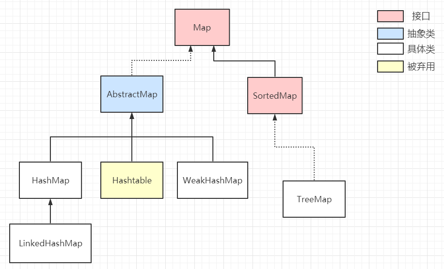
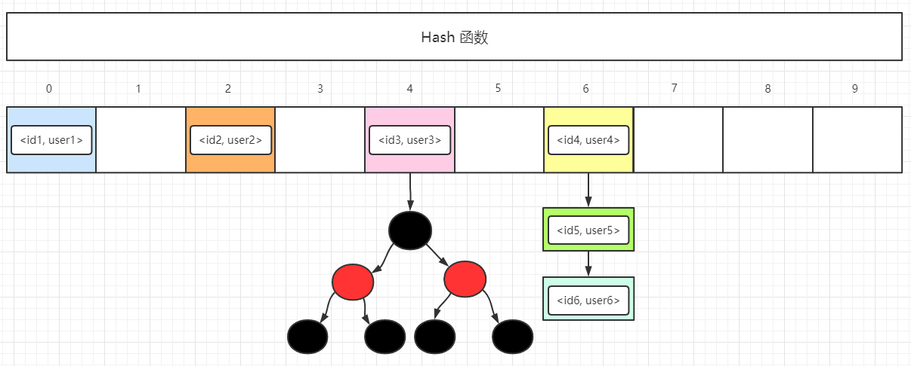
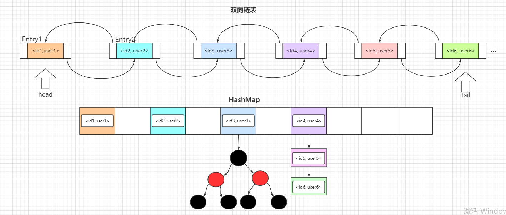

## 0 Map 集合体系详解

`Map`接口是由`<key, value>`组成的集合，由`key`映射到**唯一**的`value`，所以`Map`不能包含重复的`key`，每个键**至多**映射一个值。下图是整个 Map 集合体系的主要组成部分，我将会按照日常使用频率从高到低一一讲解。

不得不提的是 Map 的设计理念：**定位元素**的时间复杂度优化到 `O(1)`

Map 体系下主要分为 AbstractMap 和 SortedMap两类集合

`AbstractMap`是对 Map 接口的扩展，它定义了普通的 Map 集合具有的**通用行为**，可以避免子类重复编写大量相同的代码，子类继承 AbstractMap 后可以重写它的方法，**实现额外的逻辑**，对外提供更多的功能。

`SortedMap` 定义了该类 Map 具有 `排序`行为，同时它在内部定义好有关排序的抽象方法，当子类实现它时，必须重写所有方法，对外提供排序功能。



## 1 HashMap

### 底层原理
HashMap 是一个**最通用的**利用哈希表存储元素的集合，将元素放入 HashMap 时，将`key`的哈希值转换为数组的`索引`下标**确定存放位置**，查找时，根据`key`的哈希地址转换成数组的`索引`下标**确定查找位置**。

HashMap 底层是用数组 + 链表 + 红黑树这三种数据结构实现，它是**非线程安全**的集合。



发送哈希冲突时，HashMap 的解决方法是将相同映射地址的元素连成一条`链表`，如果链表的长度大于`8`时，且数组的长度大于`64`则会转换成`红黑树`数据结构。

关于 HashMap 的简要总结：

1. 它是集合中最常用的`Map`集合类型，底层由`数组 + 链表 + 红黑树`组成
2. HashMap不是线程安全的
3. 插入元素时，通过计算元素的`哈希值`，通过**哈希映射函数**转换为`数组下标`；查找元素时，同样通过哈希映射函数得到数组下标`定位元素的位置`

### 继承关系


* HashMap不能包含重复的键。
* HashMap允许多个null值，但只允许一个null键。
* HashMap是一个unordered collection 。 它不保证元素的任何特定顺序。
* HashMap not thread-safe 。 您必须显式同步对HashMap的并发修改。 或者，您可以使用Collections.synchronizedMap(hashMap)来获取HashMap的同步版本。
* 只能使用关联的键来检索值。
* HashMap仅存储对象引用。 因此，必须将原语与其对应的包装器类一起使用。 如int将存储为Integer 。


### 主要方法

```java
void clear() ：从HashMap中删除所有键-值对。
Object clone() ：返回指定HashMap的浅表副本。
boolean containsKey(Object key) ：根据是否在地图中找到指定的键，返回true或false 。
boolean containsValue(Object Value) ：类似于containsKey（）方法，它查找指定的值而不是键。
Object get(Object key) ：返回HashMap中指定键的值。
boolean isEmpty() ：检查地图是否为空。
Set keySet() ：返回存储在HashMap中的所有密钥的Set 。
Object put（Key k，Value v） ：将键值对插入HashMap中。
int size() ：返回地图的大小，该大小等于存储在HashMap中的键值对的数量。
Collection values() ：返回地图中所有值的集合。
Value remove(Object key) ：删除指定键的键值对。
void putAll(Map m) ：将地图的所有元素复制到另一个指定的地图。
```


合并两个hashmap
* 使用HashMap.putAll(HashMap)方法，即可将所有映射从第二张地图复制到第一张地图。hashmap不允许重复的键 。 因此，当我们以这种方式合并map时，对于map1的重复键，其值会被map2相同键的值覆盖。

```java
//map 1
HashMap<Integer, String> map1 = new HashMap<>();
 
map1.put(1, "A");
map1.put(2, "B");
map1.put(3, "C");
map1.put(5, "E");
 
//map 2
HashMap<Integer, String> map2 = new HashMap<>();
 
map2.put(1, "G");   //It will replace the value 'A'
map2.put(2, "B");
map2.put(3, "C");
map2.put(4, "D");   //A new pair to be added
 
//Merge maps
map1.putAll(map2);
 
System.out.println(map1);
```
* merge()函数如果我们要处理在地图中存在重复键的情况，并且我们不想丢失任何地图和任何键的数据。HashMap.merge()函数3个参数。 键，值，并使用用户提供的BiFunction合并重复键的值。跟put一样，实现了重复key的处理。

```java
Merge HashMaps Example
//map 1
HashMap<Integer, String> map1 = new HashMap<>();
 
map1.put(1, "A");
map1.put(2, "B");
map1.put(3, "C");
map1.put(5, "E");
 
//map 2
HashMap<Integer, String> map2 = new HashMap<>();
 
map2.put(1, "G");   //It will replace the value 'A'
map2.put(2, "B");
map2.put(3, "C");
map2.put(4, "D");   //A new pair to be added
 
//Merge maps
map2.forEach(
    (key, value) -> map1.merge( key, value, (v1, v2) -> v1.equalsIgnoreCase(v2) ? v1 : v1 + "," + v2)
);
 
System.out.println(map1);
```

### 遍历方法

通过不同的set遍历呗。包括EntrySet遍历、keyset遍历

```java
1)在每个循环中使用enrtySet（）
for (Map.Entry<String,Integer> entry : testMap.entrySet()) {
    entry.getKey();
    entry.getValue();
}
2）在每个循环中使用keySet（）
for (String key : testMap.keySet()) {
    testMap.get(key);
}
3）使用enrtySet（）和迭代器
Iterator<Map.Entry<String,Integer>> itr1 = testMap.entrySet().iterator();
while(itr1.hasNext())
{
    Map.Entry<String,Integer> entry = itr1.next();
    entry.getKey();
    entry.getValue();
}
4）使用keySet（）和迭代器
Iterator itr2 = testMap.keySet().iterator();
while(itr2.hasNext())
{
    String key = itr2.next();
    testMap.get(key);
}
```

## 2 LinkedHashMap

### 底层原理

LinkedHashMap 可以看作是 `HashMap` 和 `LinkedList` 的结合：它在 HashMap 的基础上添加了一条双向链表，`默认`存储各个元素的插入顺序，但由于这条双向链表，使得 LinkedHashMap 可以实现 `LRU`缓存淘汰策略，因为我们可以设置这条双向链表按照`元素的访问次序`进行排序



LinkedHashMap 是 HashMap 的子类，所以它具备 HashMap 的所有特点，其次，它在 HashMap 的基础上维护了一条`双向链表`，该链表存储了**所有元素**，`默认`元素的顺序与插入顺序**一致**。若`accessOrder`属性为`true`，则遍历顺序按元素的访问次序进行排序。

```java
// 头节点
transient LinkedHashMap.Entry<K, V> head;
// 尾结点
transient LinkedHashMap.Entry<K, V> tail;
```

利用 LinkedHashMap  可以实现 `LRU` 缓存淘汰策略，因为它提供了一个方法：

```java
protected boolean removeEldestEntry(java.util.Map.Entry<K, V> eldest) {
    return false;
}
```

该方法可以移除`最靠近链表头部`的一个节点，而在`get()`方法中可以看到下面这段代码，其作用是挪动结点的位置：

```java
if (this.accessOrder) {
    this.afterNodeAccess(e);
}
```

只要调用了`get()`且`accessOrder = true`，则会将该节点更新到链表`尾部`，具体的逻辑在`afterNodeAccess()`中，感兴趣的可翻看源码，篇幅原因这里不再展开。

现在如果要实现一个`LRU`缓存策略，则需要做两件事情：

- 指定`accessOrder = true`可以设定链表按照访问顺序排列，通过提供的构造器可以设定`accessOrder`

```java
public LinkedHashMap(int initialCapacity, float loadFactor, boolean accessOrder) {
    super(initialCapacity, loadFactor);
    this.accessOrder = accessOrder;
}
```

- 重写`removeEldestEntry()`方法，内部定义逻辑，通常是判断`容量`是否达到上限，若是则执行淘汰。

这里就要贴出一道大厂面试必考题目：[146. LRU缓存机制](https://leetcode-cn.com/problems/lru-cache/)，只要跟着我的步骤，就能顺利完成这道大厂题了。

关于 LinkedHashMap 主要介绍两点：

1. 它底层维护了一条`双向链表`，因为继承了 HashMap，所以它也不是线程安全的
2. LinkedHashMap 可实现`LRU`缓存淘汰策略，其原理是通过设置`accessOrder`为`true`并重写`removeEldestEntry`方法定义淘汰元素时需满足的条件

## 3 TreeMap

### 底层原理
TreeMap 是 `SortedMap` 的子类，所以它具有**排序**功能。它是基于`红黑树`数据结构实现的，每一个键值对`<key, value>`都是一个结点，默认情况下按照`key`自然排序，另一种是可以通过传入定制的`Comparator`进行自定义规则排序。

```java
// 按照 key 自然排序，Integer 的自然排序是升序
TreeMap<Integer, Object> naturalSort = new TreeMap<>();
// 定制排序，按照 key 降序排序
TreeMap<Integer, Object> customSort = new TreeMap<>((o1, o2) -> Integer.compare(o2, o1));
```

TreeMap 底层使用了数组+红黑树实现，所以里面的存储结构可以理解成下面这幅图哦。


图中红黑树的每一个节点都是一个`Entry`，在这里为了图片的简洁性，就不标明 key 和 value 了，注意这些元素都是已经按照`key`排好序了，整个数据结构都是保持着`有序` 的状态！

关于`自然`排序与`定制`排序：

- 自然排序：要求`key`必须实现`Comparable`接口。

由于`Integer`类实现了 Comparable 接口，按照自然排序规则是按照`key`从小到大排序。

```java
TreeMap<Integer, String> treeMap = new TreeMap<>();
treeMap.put(2, "TWO");
treeMap.put(1, "ONE");
System.out.print(treeMap);
// {1=ONE, 2=TWO}
```

- 定制排序：在初始化 TreeMap 时传入新的`Comparator`，**不**要求`key`实现 Comparable 接口

```java
TreeMap<Integer, String> treeMap = new TreeMap<>((o1, o2) -> Integer.compare(o2, o1));
treeMap.put(1, "ONE");
treeMap.put(2, "TWO");
treeMap.put(4, "FOUR");
treeMap.put(3, "THREE");
System.out.println(treeMap);
// {4=FOUR, 3=THREE, 2=TWO, 1=ONE}
```

通过传入新的`Comparator`比较器，可以覆盖默认的排序规则，上面的代码按照`key`降序排序，在实际应用中还可以按照其它规则自定义排序。

`compare()`方法的返回值有三种，分别是：`0`，`-1`，`+1`

（1）如果返回`0`，代表两个元素相等，不需要调换顺序

（2）如果返回`+1`，代表前面的元素需要与后面的元素调换位置

（3）如果返回`-1`，代表前面的元素不需要与后面的元素调换位置

而何时返回`+1`和`-1`，则由我们自己去定义，JDK默认是按照**自然排序**，而我们可以根据`key`的不同去定义降序还是升序排序。

关于 TreeMap 主要介绍了两点：

1. 它底层是由`红黑树`这种数据结构实现的，所以操作的时间复杂度恒为`O(logN)`
2. TreeMap 可以对`key`进行自然排序或者自定义排序，自定义排序时需要传入`Comparator`，而自然排序要求`key`实现了`Comparable`接口
3. TreeMap 不是线程安全的。它不synchronized 。 使用Collections.synchronizedSortedMap(new TreeMap())在并发环境中工作。
4. 它不能具有null键，但可以具有多个null值。
5. 它以排序顺序（自然顺序）或地图创建时提供的Comparator来存储键。
6. 它为containsKey ， get ， put和remove操作提供了保证的log(n)时间成本。

### 主要方法

```java
void clear():从地图中删除所有键/值对。
void size():返回此映射中存在的键值对的数量。
void isEmpty():如果此映射不包含键值映射，则返回true。
boolean containsKey(Object key):如果地图中存在指定的键，则返回'true' 。
boolean containsValue(Object key):如果将指定值映射到映射中的至少一个键，则返回'true' 。
Object get(Object key):检索由指定key映射的值；如果此映射不包含key映射关系，则返回null。
Object remove(Object key):如果存在，则从映射中删除指定键的键值对。
Comparator comparator():它返回用于对该映射中的键进行排序的比较器；如果此映射使用其键的自然排序，则返回null。
Object firstKey():返回树图中当前的第一个（最小）键。
Object lastKey():返回树图中当前的最后一个（最大）键。
Object ceilingKey(Object key):返回大于或等于给定键的最小键；如果没有这样的键，则返回null。
Object higherKey(Object key):返回严格大于指定键的最小键。
NavigableMap descendingMap():它返回此地图中包含的映射的reverse order view 。
```

## 4 WeakHashMap

WeakHashMap 日常开发中比较少见，它是基于普通的`Map`实现的，而里面`Entry`中的键在每一次的`垃圾回收`都会被清除掉，所以非常适合用于**短暂访问、仅访问一次**的元素，缓存在`WeakHashMap`中，并尽早地把它回收掉。

当`Entry`被`GC`时，WeakHashMap 是如何感知到某个元素被回收的呢？

在 WeakHashMap 内部维护了一个引用队列`queue`

```java
private final ReferenceQueue<Object> queue = new ReferenceQueue<>();
```

这个 queue 里包含了所有被`GC`掉的键，当JVM开启`GC`后，如果回收掉 WeakHashMap 中的 key，会将 key 放入queue 中，在`expungeStaleEntries()`中遍历 queue，把 queue 中的所有`key`拿出来，并在 WeakHashMap 中删除掉，以达到**同步**。

```java
private void expungeStaleEntries() {
    for (Object x; (x = queue.poll()) != null; ) {
        synchronized (queue) {
            // 去 WeakHashMap 中删除该键值对
        }
    }
}
```

再者，需要注意 WeakHashMap 底层存储的元素的数据结构是`数组 + 链表`，**没有红黑树**哦，可以换一个角度想，如果还有红黑树，那干脆直接继承 HashMap ，然后再扩展就完事了嘛，然而它并没有这样做：

```java
public class WeakHashMap<K, V> extends AbstractMap<K, V> implements Map<K, V> {
    
}
```

所以，WeakHashMap 的数据结构图我也为你准备好啦。


图中被虚线标识的元素将会在下一次访问 WeakHashMap 时被删除掉，WeakHashMap 内部会做好一系列的调整工作，所以记住队列的作用就是标志那些已经被`GC`回收掉的元素。

关于 WeakHashMap 需要注意两点：

1. 它的键是一种**弱键**，放入 WeakHashMap 时，随时会被回收掉，所以不能确保某次访问元素一定存在
2. 它依赖普通的`Map`进行实现，是一个非线程安全的集合
3. WeakHashMap 通常作为**缓存**使用，适合存储那些**只需访问一次**、或**只需保存短暂时间**的键值对

## 5 Hashtable
### 底层原理
Hashtable 底层的存储结构是`数组 + 链表`，而它是一个**线程安全**的集合，但是因为这个线程安全，它就被淘汰掉了。

下面是Hashtable存储元素时的数据结构图，它只会存在数组+链表，当链表过长时，查询的效率过低，而且会长时间**锁住** Hashtable。


> 本质上就是 WeakHashMap 的底层存储结构了。你千万别问为什么 WeakHashMap 不继承 Hashtable 哦，Hashtable 的`性能`在并发环境下非常差，在非并发环境下可以用`HashMap`更优。

HashTable 本质上是 HashMap 的前辈，它被淘汰的原因也主要因为两个字：**性能**

HashTable 是一个 **线程安全** 的 Map，它所有的方法都被加上了 **synchronized** 关键字，也是因为这个关键字，它注定成为了时代的弃儿。

HashTable 底层采用 **数组+链表** 存储键值对，由于被弃用，后人也没有对它进行任何改进

HashTable 默认长度为 `11`，负载因子为 `0.75F`，即元素个数达到数组长度的 75% 时，会进行一次扩容，每次扩容为原来数组长度的 `2` 倍

HashTable 所有的操作都是线程安全的。

### 方法
跟hashtable一样

## 6 ConcurrentHashMap

### 底层原理
oncurrentHashMap通过设计支持并发访问其键值对。


### 使用方法

创建和读写
```java
import java.util.Iterator;
import java.util.concurrent.ConcurrentHashMap;
 
public class HashMapExample 
{
    public static void main(String[] args) throws CloneNotSupportedException 
    {
        ConcurrentHashMap<Integer, String> concurrHashMap = new ConcurrentHashMap<>();
         
        //Put require no synchronization
        concurrHashMap.put(1, "A");
        concurrHashMap.put(2, "B");
         
        //Get require no synchronization
        concurrHashMap.get(1);
         
        Iterator<Integer> itr = concurrHashMap.keySet().iterator();
         
        //Using synchronized block is advisable
        synchronized (concurrHashMap) 
        {
            while(itr.hasNext()) {
                System.out.println(concurrHashMap.get(itr.next()));
            }
        }
    }
}
```

使用Collection.synchronizedMap也有同样的方法

```java
import java.util.Collections;
import java.util.HashMap;
import java.util.Iterator;
import java.util.Map;
 
public class HashMapExample 
{
    public static void main(String[] args) throws CloneNotSupportedException 
    {
        Map<Integer, String> syncHashMap = Collections.synchronizedMap(new HashMap<>());
         
        //Put require no synchronization
        syncHashMap.put(1, "A");
        syncHashMap.put(2, "B");
         
        //Get require no synchronization
        syncHashMap.get(1);
         
        Iterator<Integer> itr = syncHashMap.keySet().iterator();
         
        //Using synchronized block is advisable
        synchronized (syncHashMap) 
        {
            while(itr.hasNext()) {
                System.out.println(syncHashMap.get(itr.next()));
            }
        }
    }
}
```